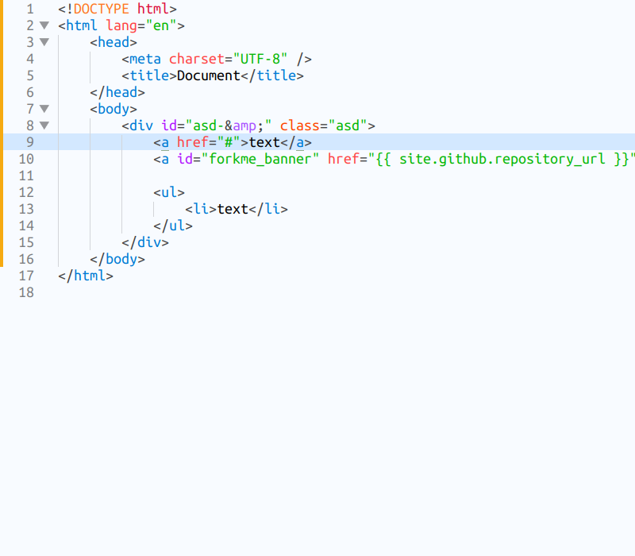
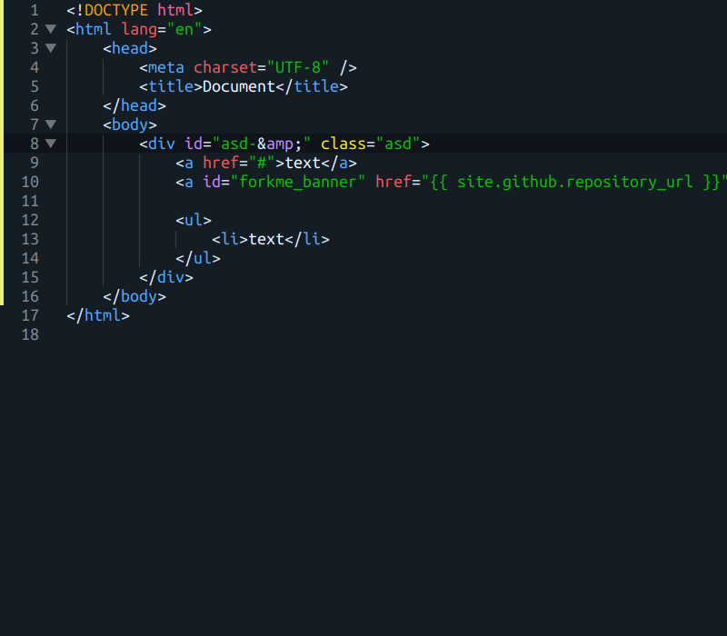
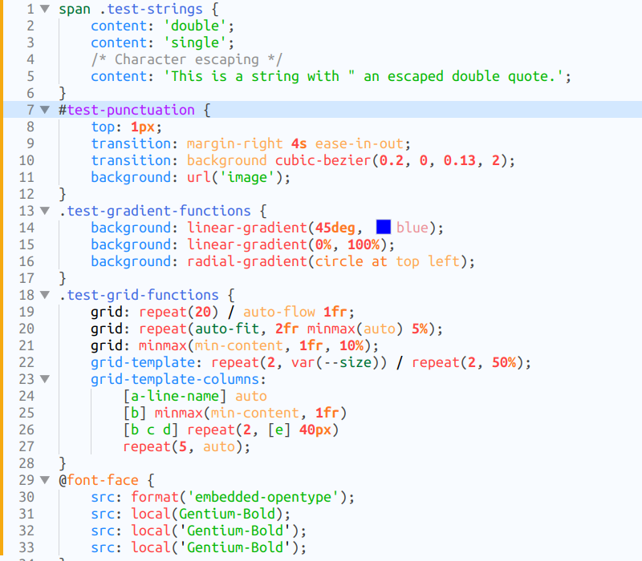
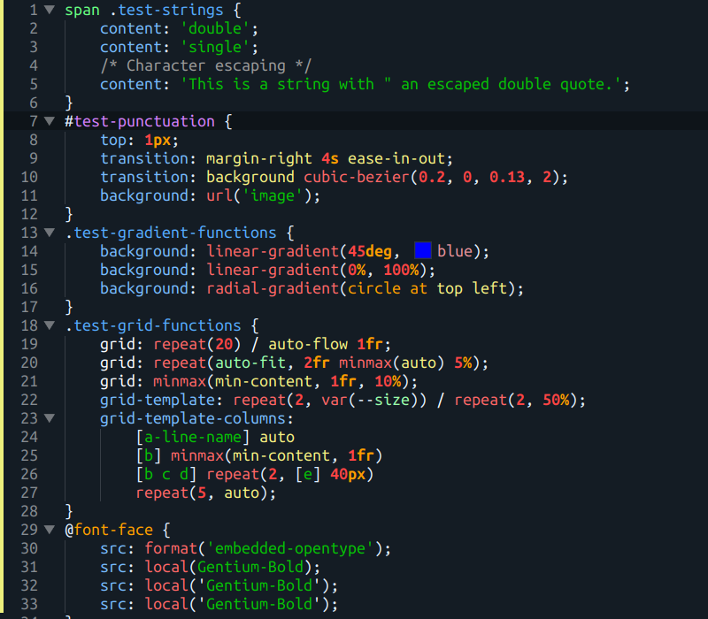
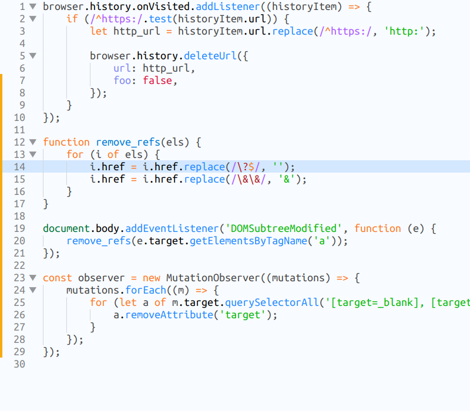
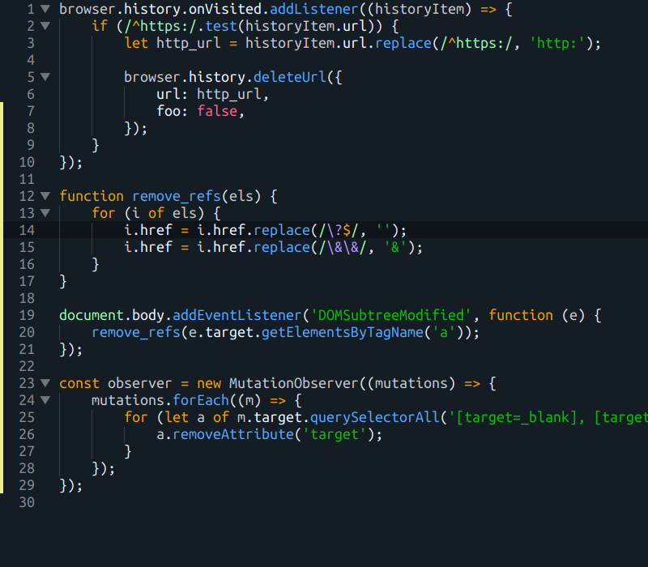
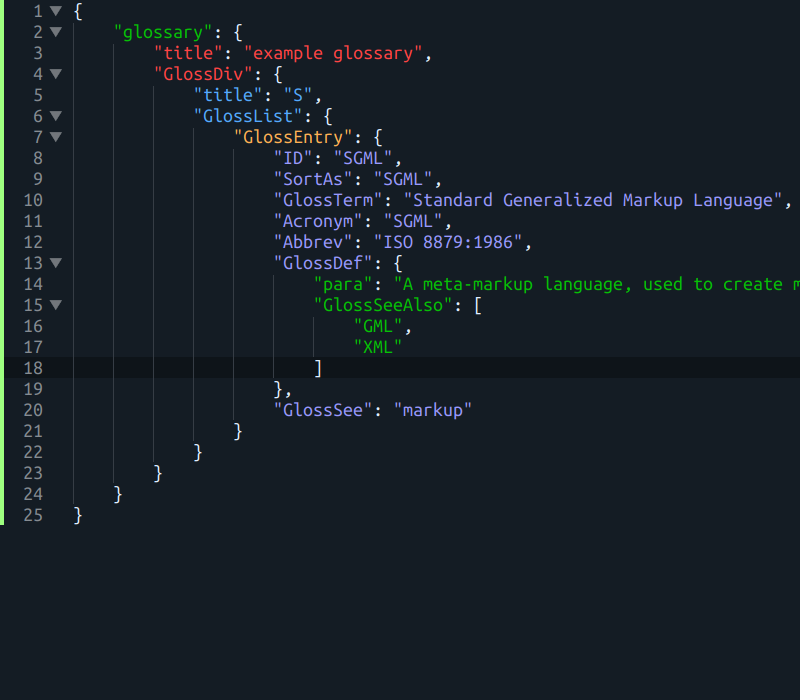

# {{ site.github.project_title | replace:'-',' ' | capitalize }}

Light and dark color scheme for [Sublime Text](https://www.sublimetext.com) and [Visual Studio Code](https://code.visualstudio.com).

## Screenshots

### HTML

### Python

### CSS

### JavaScript

### JSON

