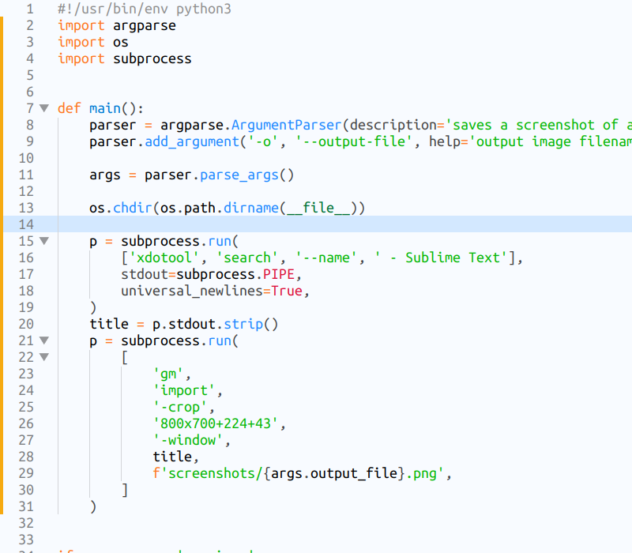
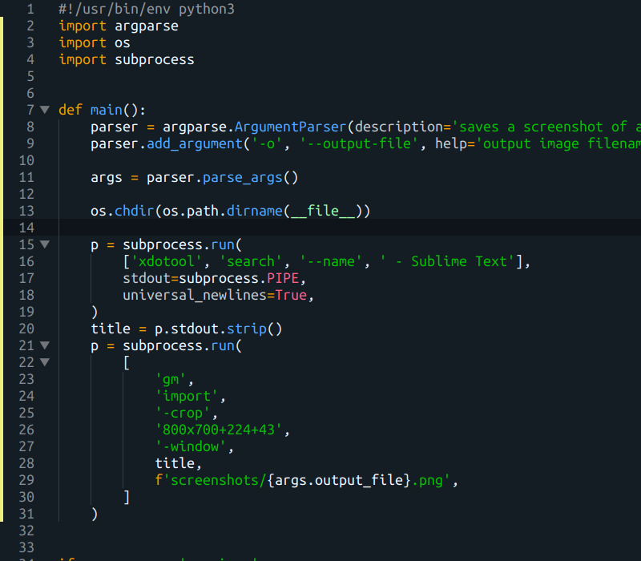

# {{ site.github.project_title | replace:'-',' ' | capitalize }}

Light and dark color scheme for [Sublime Text](https://www.sublimetext.com) and [Visual Studio Code](https://code.visualstudio.com).

## Installation

Sublime Text packagecontrol: [https://packagecontrol.io/packages/Silence Color Scheme](https://packagecontrol.io/packages/Silence%20Color%20Scheme)

Visual Studio Code marketplace: [https://marketplace.visualstudio.com/items?itemName=iulian-tatarascu.silence-theme](https://marketplace.visualstudio.com/items?itemName=iulian-tatarascu.silence-theme)

## Screenshots

### HTML

### Python

### CSS

### JavaScript

### JSON

